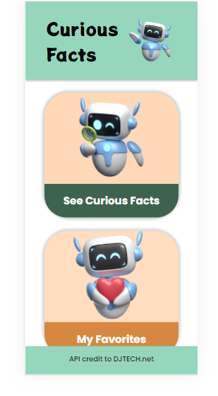
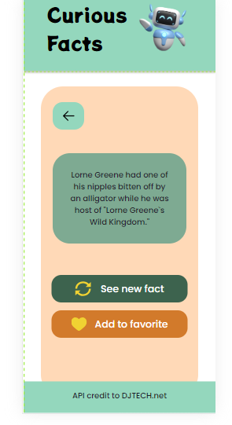

 ## 🌸 Curiosfacts
¡Bienvenido a Curious Facts, donde la curiosidad se encuentra con la diversión! 🚀 Descubre hechos curiosos fascinantes y guarda tus favoritos para compartirlos con tus amigos. Este es el repositorio de la aplicación web "Curious Facts". 🌺📱

## 🌈 Características Principales
Explora Hechos Curiosos: Dirígete a Curious Facts para descubrir curiosidades fascinantes. 🤓🌐
Favoritos: Consulta tus favoritos en My Favorites.❤️🌟
Diseño Atractivo: La interfaz está diseñada con ilustraciones de robots, ¡haciendo que la experiencia sea aún más divertida! 🤖✨
Responsive: ¡Adaptable como las flores al sol! 🌞🌈

**Tecnología y Metodología Implementada:**
🏗️ Estructura - HTML
🎨 Estilos - CSS
🚀 Funcionalidades - JavaScript
🧪 Test Unitario - Vitest / Jest
🎭 Flex
🌐 Integración de API Externa
🌿 GitFlow  
Marcos de Trabajo: 📋 Kanban y Scrum 
Enfoques: 🏎️ Ágiles 
Metodología de Diseño: 🪶 Atomic Design 
🙌 Créditos de la API
La aplicación utiliza datos de la API proporcionada por DJTECH.net

**Herramientas 🛠️**
🐙 Github
📝 Visual Studio Code
🎨 Figma
📌 Trello

 ## 🧬 Instalación
1. Debe tener instalado Visual Studio Code 
2. Clonación del Repositorio con el comando:
   https://github.com/vicki-robertson/curious-fem.git
3. Abre el archivo index.html en tu navegador web para acceder a la página principal.

**🧪 Instalación de Jest para Test Unitarios**
Para ejecutar y realizar test unitarios en la aplicación, utilizamos Jest, un marco de pruebas de JavaScript.
Sigue estos pasos para configurar Jest en tu proyecto:
Instalación de Jest:
1-Ejecuta el siguiente comando en la terminal de tu proyecto para instalar Jest:
npm install --save-dev jest
2-Configuración de package.json:
Agrega la siguiente configuración a tu archivo package.json:

{
  "scripts": {
    "test": "jest"
  }
}

## ✨ Equipo
Para preguntas o asistencia, no dudes en contactarnos:
- Correo electrónico, o bien de manera individual en:

- 🌸Gabriela Irimia: [] 
- 🌼Vicki Robertson: [] 
- 🌻Hemi Hemileidis: [] 

**🌍 Vista de Conjunto**

## Mobil

## Desktop
